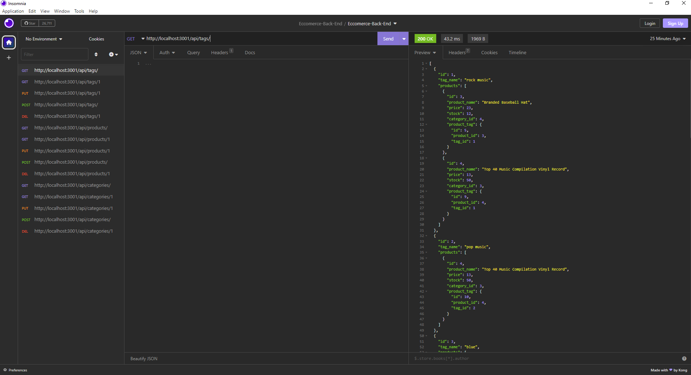

# E-commerce-Back-End
 ## Description 
 An ecommerce back end for products, tags, and categories
  
 ## Table Of Contents 
 - [Title](#title) 
 - [Description](#description) 
 - [Installation](#installation) 
 - [Usage](#usage) 
 - [License](#license) 
 - [Contributing](#contributing) 
 - [Test](#test) 
 - [Questions](#questions) 
 ## Installation 
   Dependencies:
    dotenv: "^8.2.0"
    express: "^4.17.1"
    mysql2: "^2.1.0"
    sequelize: "^5.21.7"
 ## Usage 
 Can test routes in Insomnia
  
 caption: Example Get Routes in Insomnia
 

 

 ## License 
 MIT License 
  
 ## Contributing 
 Michael Smith
  
 Github: https://github.com/AustinBQ02
  
 Rebecca Girndt
  
 GitHub: https://github.com/Re-Gi
  
 ## Test 
 NA 
 ## Questions 
 UserName: Nick-McCarthy 
 https://github.com/Nick-McCarthy

